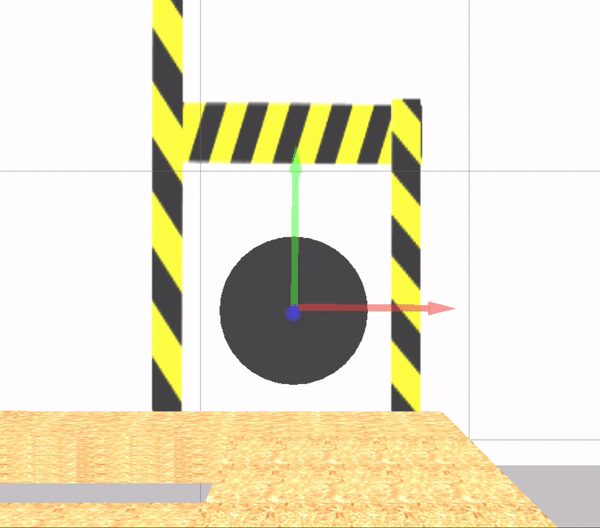
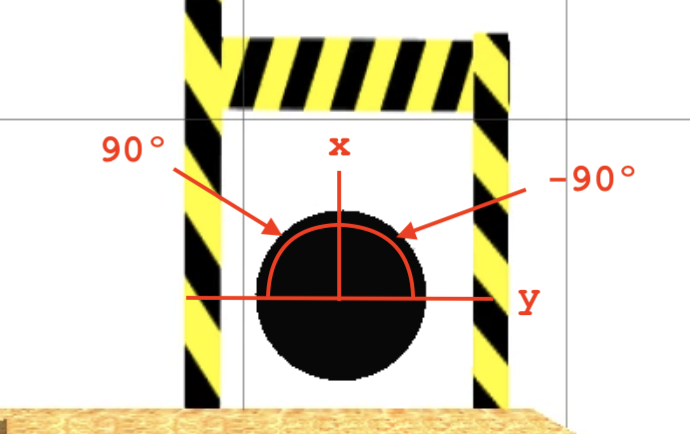

# Checkpoint 2 - Introduction to ROS

ROS service node that provides an out-of-the-box rotation functionality for the RB-1 robot built in [Checkpoint 1](https://github.com/mathrosas/Introduction-to-Gazebo). A custom ROS Service (`/rotate_robot`) allows users to rotate the robot by a specified number of degrees relative to its current orientation.

Part of the [ROS & ROS 2 Developer Master Class](https://www.theconstructsim.com/) certification (Phase 1).

<p align="center">
  
</p>

## How It Works

The `/rotate_robot` service receives a rotation angle in degrees and rotates the robot accordingly using the differential drive controller. The rotation is **relative to the robot's current frame**, not the world frame, meaning it can be called from any starting orientation.

<p align="center">
  
</p>

- **Positive degrees** (e.g., `90`): counter-clockwise rotation
- **Negative degrees** (e.g., `-90`): clockwise rotation

### Algorithm

1. Subscribes to `/odom` and extracts current yaw from the quaternion orientation
2. Computes the target yaw by adding the requested rotation (converted to radians) to the current yaw
3. Publishes angular velocity commands to `/cmd_vel` at 0.5 rad/s
4. Continuously checks the angle difference, normalizing to [-pi, pi]
5. Stops when within ~1 degree of the target
6. Returns a success/failure message

## Custom Service Message

**`Rotate.srv`**

```
int32 degrees
---
string result
```

- **Request**: `degrees` - number of degrees to rotate (positive = CCW, negative = CW)
- **Response**: `result` - status message indicating completion

## Project Structure

```
my_rb1_robot/
├── my_rb1_ros/
│   ├── CMakeLists.txt
│   ├── package.xml
│   ├── launch/
│   │   └── rotate_service.launch
│   ├── src/
│   │   └── rotate_service.py
│   └── srv/
│       └── Rotate.srv
│
├── my_rb1_description/   # From Checkpoint 1
├── my_rb1_gazebo/         # From Checkpoint 1
└── media/
```

## How to Use

### Prerequisites

- Completed [Checkpoint 1](https://github.com/mathrosas/Introduction-to-Gazebo) (RB-1 simulation)
- ROS Noetic
- Gazebo 11

### Build

```bash
cd ~/catkin_ws
catkin_make
source devel/setup.bash
```

### 1. Launch the Simulation

```bash
roslaunch my_rb1_gazebo my_rb1_robot_warehouse.launch
```

### 2. Start the Rotation Service

```bash
roslaunch my_rb1_ros rotate_service.launch
```

### 3. Call the Service

```bash
# Rotate 90 degrees counter-clockwise
rosservice call /rotate_robot "degrees: 90"

# Rotate 90 degrees clockwise
rosservice call /rotate_robot "degrees: -90"
```

The service can be called multiple times consecutively from any starting position.

## ROS Topics and Services

| Name | Type | Description |
|---|---|---|
| `/rotate_robot` | `my_rb1_ros/Rotate` (service) | Accepts rotation in degrees, returns result |
| `/cmd_vel` | `geometry_msgs/Twist` (publisher) | Sends angular velocity commands |
| `/odom` | `nav_msgs/Odometry` (subscriber) | Reads current orientation for yaw tracking |

## Key Concepts Covered

- **ROS Services**: custom `.srv` message definition, service server implementation
- **Odometry processing**: quaternion to Euler conversion using `tf.transformations`
- **Robot-frame rotation**: relative rotation independent of world frame
- **Velocity control**: publishing `Twist` messages for angular movement
- **Angle normalization**: handling wrap-around at +/-pi boundaries

## Technologies

- ROS Noetic
- Gazebo Classic 11
- Python 2
- `tf` library (quaternion/Euler conversions)
